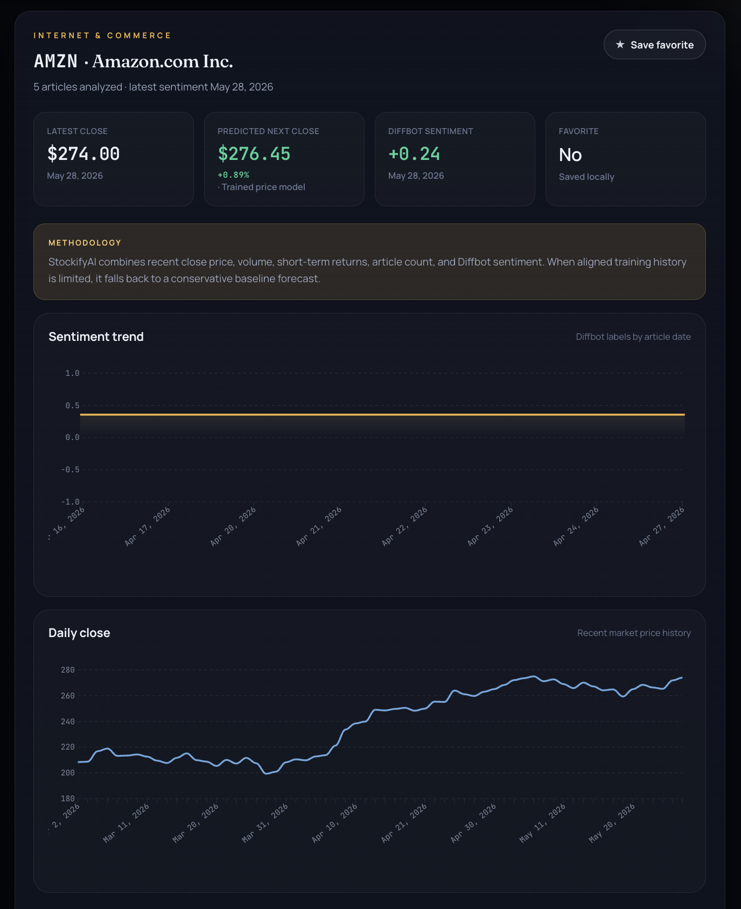

# StockifyAI

StockifyAI is a full-stack market intelligence platform that analyzes S&P 500 technology and tech-adjacent companies using financial news sentiment and historical market data.

## Dashboard

  

## Company Analytics

  

## Features

- TechCrunch article ingestion
- Diffbot sentiment extraction
- Historical stock price collection
- Local machine learning forecasting
- Interactive Vue.js dashboard

## Tech Stack

### Frontend
- Vue.js
- ApexCharts
- Vite

### Backend
- FastAPI
- SQLAlchemy
- SQLite

### Machine Learning
- Scikit-Learn
- NumPy
- Pandas
