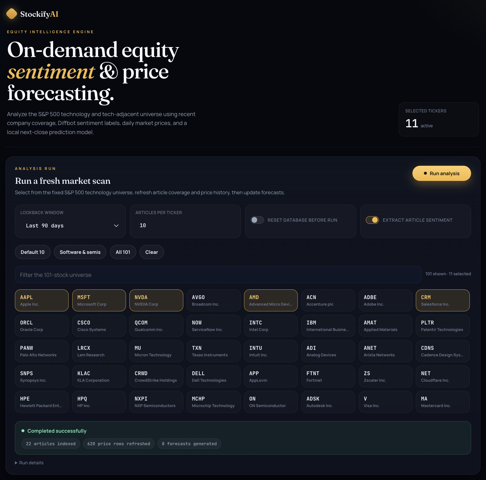

# StockifyAI

StockifyAI is a full-stack equity intelligence dashboard for analyzing S&P 500 technology and tech-adjacent companies using news sentiment, daily market data, and a local forecasting pipeline.

The project lets a user select companies, run an on-demand analysis, ingest recent article coverage, extract sentiment with Diffbot, refresh historical price data, and compare sentiment trends against price movement and next-close forecasts.

<p>
  
</p>

## What It Does

StockifyAI turns recent company coverage and market prices into ticker-level analytics.

For each selected company, the system:

1. Searches for recent company-related coverage.
2. Extracts article text, metadata, and sentiment labels using Diffbot.
3. Refreshes recent daily OHLC market prices.
4. Stores article, sentiment, price, and forecast data locally.
5. Carries sentiment forward across price dates until a newer article signal is observed.
6. Builds price and sentiment features.
7. Generates a next-close forecast.
8. Displays the results in an interactive Vue dashboard.

The app is designed as a local research tool rather than a public trading product. It emphasizes reproducible ingestion, transparent article evidence, and explainable forecast inputs.

## Core Features

### S&P 500 Tech Universe

StockifyAI tracks a fixed universe of S&P 500 technology and tech-adjacent companies. The dashboard includes searchable ticker selection, preset batches, and company rankings so users can run focused scans or analyze broader market segments.

### Article Sentiment Ingestion

The backend collects recent company coverage and uses Diffbot's Article API to extract:

- Article title
- Source
- URL
- Publication date
- Summary/text
- Sentiment score

Each article card in the dashboard links back to the original source so the sentiment signal can be inspected rather than treated as a black box.

### Market Price Collection

The backend refreshes recent daily OHLC price data for each selected ticker. These rows are stored locally and used for both visualization and forecasting.

Tracked market fields include:

- Open
- High
- Low
- Close
- Volume
- Trading date

### Sentiment Carry-Forward

Article sentiment is naturally sparse because companies do not receive relevant coverage every trading day. To make article sentiment usable as a market feature, StockifyAI carries the most recent sentiment value forward until a newer sentiment observation is recorded.

This creates a continuous ticker-date signal that can be joined with daily market prices.

### Forecasting Pipeline

StockifyAI generates next-close forecasts using engineered market and sentiment features.

The model pipeline uses signals such as:

- Latest close price
- Daily volume
- One-day return
- Five-day return
- Article count
- Carried-forward Diffbot sentiment

When there is enough aligned sentiment and price history, the backend trains a Scikit-Learn forecasting model. When aligned data is limited, it falls back to a conservative baseline forecast so the dashboard remains usable.

### Interactive Dashboard

The frontend provides:

- Ticker search and filtering
- Bulk ticker selection presets
- Company rankings by predicted return, sentiment, article count, or ticker
- Sentiment trend charts
- Daily close charts
- Forecast cards
- Article evidence cards
- Local favorites saved in the browser

## Architecture

```text
Article discovery
  -> Diffbot Article API
  -> Article sentiment records
  -> SQLite

Daily price ingestion
  -> OHLC price records
  -> SQLite

SQLite
  -> Sentiment carry-forward
  -> Feature engineering
  -> Scikit-Learn forecasting
  -> FastAPI analytics endpoints
  -> Vue + ApexCharts dashboard
```

## Machine Learning Pipeline

The forecasting workflow is built around ticker-date examples.

For each ticker:

1. Article sentiment is aggregated by publication date.
2. Historical daily prices are refreshed for the selected lookback window.
3. Sentiment values are carried forward across price dates.
4. Price rows and sentiment rows are joined by ticker/date.
5. Feature vectors are constructed from market movement, article volume, and sentiment.
6. The target is the next trading day's closing price.
7. Forecasts are served through FastAPI and rendered in the dashboard.

This makes the dashboard more than a static visualization layer: it performs ingestion, local persistence, feature engineering, model execution, and interactive analysis.

## Tech Stack

### Frontend

- Vue.js
- Vite
- ApexCharts
- Custom CSS

### Backend

- Python
- FastAPI
- SQLAlchemy
- SQLite

### Data and ML

- Diffbot Article API
- Public market price feeds
- Scikit-Learn
- Pandas
- NumPy

## Project Structure

```text
stockifyai/
├── backend/
│   ├── app/
│   │   ├── main.py
│   │   ├── live_ingest.py
│   │   ├── diffbot_client.py
│   │   ├── stock_price_client.py
│   │   ├── pipeline.py
│   │   ├── models.py
│   │   ├── database.py
│   │   └── stocks.py
│   ├── requirements.txt
│   └── .env.example
│
├── frontend/
│   ├── src/
│   │   ├── App.vue
│   │   ├── main.js
│   │   └── style.css
│   ├── package.json
│   └── vite.config.js
│
├── docs/
│   ├── dashboard.png
│   └── company-detail.png
│
└── README.md
```

## Running Locally

### Prerequisites

You will need:

- Python 3.11+
- Node.js 18+
- npm
- Diffbot API token

### 1. Clone the Repository

```bash
git clone https://github.com/samavramov/stockifyai.git
cd stockifyai
```

### 2. Configure the Backend

```bash
cd backend
python3.11 -m venv .venv
source .venv/bin/activate
python -m pip install --upgrade pip
python -m pip install -r requirements.txt
```

Create your environment file:

```bash
cp .env.example .env
```

Open `.env` and add your Diffbot token:

```env
DIFFBOT_TOKEN=your_diffbot_token_here
DATABASE_URL=sqlite:///./stockify.db
DIFFBOT_KG_DQL_ENDPOINT=https://kg.diffbot.com/kg/v3/dql
DIFFBOT_ARTICLE_ENDPOINT=https://api.diffbot.com/v3/article
DIFFBOT_ENRICH_WITH_ARTICLE_API=true
```

Start the backend:

```bash
python -m uvicorn app.main:app --reload --port 8000
```

The backend will run at:

```text
http://localhost:8000
```

FastAPI docs are available at:

```text
http://localhost:8000/docs
```

### 3. Configure the Frontend

Open a second terminal:

```bash
cd frontend
npm install
npm run dev
```

The frontend will run at:

```text
http://localhost:5173
```

## Recommended First Run

In the dashboard, start with a small analysis batch:

```text
Tickers: AAPL, MSFT, NVDA, GOOGL, AMZN
Articles per ticker: 5
Lookback window: 90 days
Reset database: enabled
Extract article sentiment: enabled
```

After the run completes, the dashboard should show:

- Articles indexed
- Price rows refreshed
- Forecasts generated
- Company-level forecast cards
- Sentiment and price charts
- Article evidence cards

## API Overview

The backend exposes endpoints for:

- Loading the tracked stock universe
- Running live ingestion
- Fetching market summary statistics
- Listing analyzed stocks
- Fetching ticker-level sentiment history
- Fetching ticker-level price history
- Fetching recent analyzed articles

Example local API docs:

```text
http://localhost:8000/docs
```

## Notes on Forecasting

StockifyAI is a research prototype. The forecast is not intended to be used as financial advice.

The model is designed to demonstrate a complete machine learning workflow:

- Data ingestion
- Local persistence
- Feature engineering
- Model execution
- Dashboard visualization

Forecast quality depends on the amount of aligned sentiment and market history available for the selected tickers.

## GitHub Hygiene

The repository intentionally excludes local runtime artifacts such as:

- `.env`
- virtual environments
- SQLite databases
- `node_modules`
- build outputs
- Python cache files

Use `.env.example` as the template for local configuration.

## Disclaimer

This project is for educational and research purposes only. Forecasts are experimental and should not be interpreted as financial advice.
